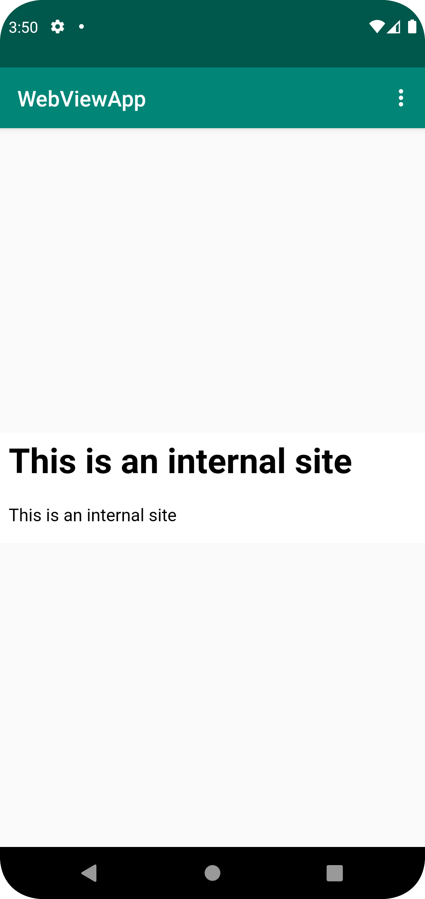
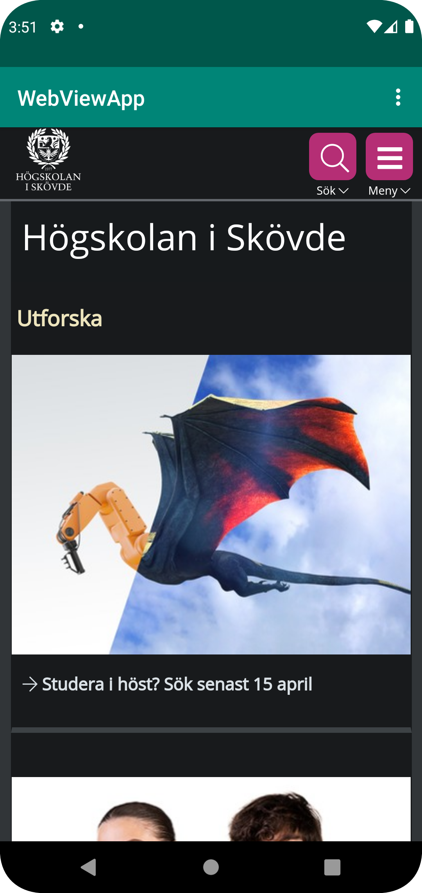

# Rapport

**Rapport Uppgift 2**

Jag har följt instruktionerna och skapat två funktioner som kallas genom toolbar dropdown, en med en intern sida som byggts med android asset folder, samt en extern sida som pekar utåt.
Jag stötte på ett problem när jag försökte länka till min prototyp på wwwlab.webug.se, möjligtvis pga attackskydd med cloudflare eller liknande pga emulering.

Appen funkar felfritt nu när den pekar på his.se och gör sitt jobb.
Följande kod har jag använt och kallat på för mina knapptryck för att ladda sidorna.
```
    public void showExternalWebPage(){
        myWebView.loadUrl("https://his.se");
    }

    public void showInternalWebPage(){
        myWebView.loadUrl("file:///android_asset/page.html");
    }
```

Och denna kod är den som hanterar knapptrycket på dropdownen.
```
        if (id == R.id.action_external_web) {
            Log.d("==>","Will display external web page");
            showExternalWebPage();
            return true;
        }

        if (id == R.id.action_internal_web) {
            Log.d("==>","Will display internal web page");
            showInternalWebPage();
            return true;
        }
```
Detta genererar en bra och funktionell sida med tillgång till internet genom att tillåta det genom manifest.




